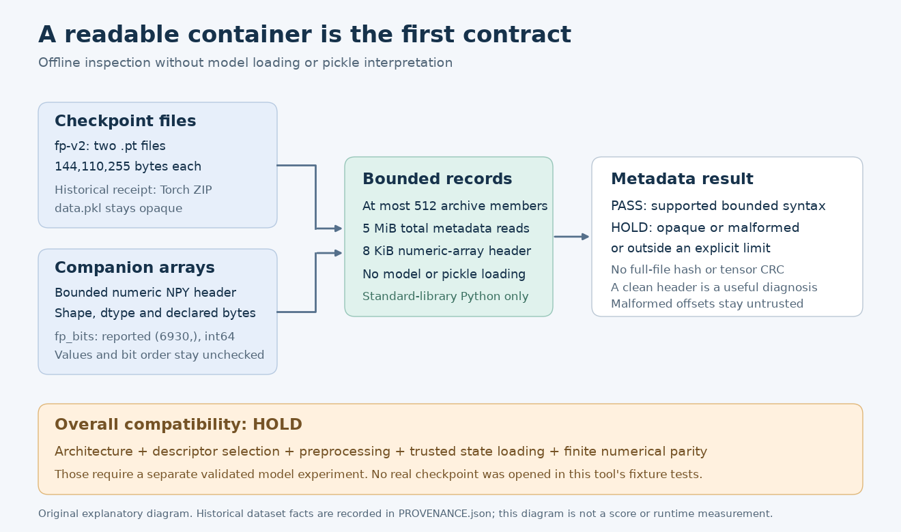

# Inspect a checkpoint container before loading a model

This small offline tool explains what can be checked without importing PyTorch or NumPy, allocating tensors, or opening a pickle. It is original standard-library code, with invented in-memory regression fixtures.

The immediate use is the [CASMI26 fingerprint models v2 bundle](https://www.kaggle.com/datasets/prvsiyan/casmi26-fp-models-v2), which is widely attached to the campaign's public notebooks. Its two data-version-1 files are `fp_single_s2.pt` and `fp_merged_m1.pt`, each 144,110,255 bytes. Earlier header receipts identified Torch ZIP `data.pkl` members. The card reports a 6,930-bit output, width 512 and six layers; this tool does **not** recover or independently verify those dimensions from the opaque pickle.



The [vector version](contract-diagram-v2.svg) and original drawing scripts are included.

## Run locally or in a Kaggle CPU notebook

Python 3.10 or later is sufficient. There is no package installation, network request or model download in the inspector. Give it an already available local file:

```bash
python3 checkpoint_container_inspector.py /path/to/fp_single_s2.pt
python3 checkpoint_container_inspector.py /path/to/fp_bits.npy
```

The same source can run against a dataset already mounted in a Kaggle CPU notebook. It needs neither GPU nor TPU.

```python
from pathlib import Path
from checkpoint_container_inspector import inspect_stream

path = Path('/kaggle/input/casmi26-fp-models-v2/fp_single_s2.pt')
with path.open('rb') as handle:
    report = inspect_stream(handle)
print(report['metadata_status'], report['verdict'])
```

Successful metadata inspection returns `PASS_BOUNDED_CONTAINER` or `PASS_BOUNDED_HEADER`. The overall verdict remains **HOLD** because architecture, runtime and numerical compatibility require separate trusted validation. A CLI exit code of zero means only that the supported metadata checks completed; it is not permission to load an arbitrary checkpoint or evidence that inference will work. Exit code two means unsupported, malformed, unreadable or out-of-budget input.

## What the tool reads

For a supported Torch ZIP layout, it reads the fixed end record, bounded central-directory records, purported local headers and names, and at most 32 bytes each from the purported `version` and `byteorder` marker files. It reports the number and declared total bytes of `data/<number>` storage members. It never extracts archive members, instantiates tensors or deserializes a model. Record offsets are untrusted: a forged offset can direct a bounded header read into bytes that another record calls pickle or storage payload before the scanner returns HOLD. Physical payload-access assurance therefore remains explicitly **UNVERIFIED_ON_UNTRUSTED_OFFSETS**. The no-deserialization contract is separate from that access limitation.

ZIP64 end and member-size records are supported within the same small-file budget. Archive comments, compressed/encrypted members, multiple disks, duplicate names, unsafe paths, symlinks, overlapping extents and unsupported layouts return HOLD. The parser checks count and directory bounds before collecting members. A no-comment end record is deliberately required to avoid a broad backward scan through purported payload bytes. This narrower read policy cannot authenticate attacker-controlled offsets.

For a numeric NPY file, it reads only the framing and a bounded header. A small, bounded literal syntax tree supplies shape, byte order, numeric dtype and declared payload size. Object, string, structured and other unsupported dtypes return HOLD. There is no `numpy.load`, array allocation or value inspection. Header shape and payload length equality do not establish values, selected-bit order, sorted masses or row alignment.

Every default limit is visible in `Limits`: 512 MiB file size, 5 MiB cumulative metadata reads, 4 MiB central directory, 512 members, 256-byte names, 8 KiB member extras, 256-byte member comments, 8 KiB NPY headers, 128 syntax-tree nodes, depth eight, four dimensions, ten million per dimension and 512 million elements. A caller can pass a smaller `Limits` instance for a narrower local policy. Every value must be a positive integer within its published ceiling; booleans, noninteger values, zero, negative and above-ceiling values are rejected. An invalid object passed as `limits` returns HOLD before any input read.

No full-file content hash or tensor CRC is computed. The tests intentionally alter a storage byte and confirm that the result still reports content integrity as unverified. Tiny marker CRCs are checked; they are not a substitute for authenticating the complete file.

## Keep three different contracts separate

| Contract | What this tool can establish | What remains unverified |
|---|---|---|
| Container | Supported ZIP records, consistent metadata extents, numeric NPY header and declared file size | Full weight/content integrity, trust and provenance |
| Architecture and preprocessing | The externally published contract can be recorded alongside the result | State-dict names/shapes, FPNet construction, selected descriptor order, peak/adduct/instrument/merging conventions |
| Runtime and numerical behavior | Inspector Python version and machine byte order | PyTorch/RDKit versions, accelerator compatibility, strict state loading, finite outputs, matched preprocessing parity and scientific accuracy |

The companion `fp_bits.npy` is reported as a `(6930,)` int64 vector in the earlier COCONUT header audit; a new vector of the same size can contain a different selection order. Similarly, a `.pt` filename or 6,930 reported logits cannot establish compatibility with another model release. Pin the exact dataset version, full-file hashes, original architecture and preprocessing together when preparing a separate trusted inference test.

## Regressions and provenance

Run the invented controls with:

```bash
python3 -m unittest -v test_checkpoint_container_inspector.py
```

They cover normal ZIP and ZIP64 layouts, descriptor records, duplicate/unsafe members, compressed or opaque layouts, misleading sizes, CRC disagreements, NPY version/shape/dtype limits, header expressions, truncation, payload length, well-formed fixture read-range separation, forged-offset access before HOLD, and invalid caller limits. They never use the real model files. `TEST_RECEIPT.json` records the author's bounded worker run; its result validates the tested parser behavior rather than the actual checkpoints.

`PROVENANCE.json` distinguishes existing campaign inventory/header facts from the newly invented fixtures. The inspector and diagram were written from scratch. Primary references are the [PyTorch serialization format documentation](https://docs.pytorch.org/docs/2.14/notes/serialization.html), [NumPy NPY-format documentation](https://numpy.org/doc/stable/reference/generated/numpy.lib.format.html), and [Python ZIP documentation](https://docs.python.org/3/library/zipfile.html). No implementation, training code or prompt from another Kaggle author is bundled here.

The tool and its original tests/diagram use the accompanying MIT license. That license applies to this tool; the current fp-v2 dataset label is CC BY-NC-SA 4.0. No weights or upstream training data are redistributed by this package.

Revision 2 preserves the initial source and receipt locally and incorporates independent review: the first revision overclaimed physical payload-read exclusion on malformed offsets. An instrumented invented adversarial fixture demonstrates why that assurance must remain unverified. No real weight or pickle was opened during either revision.
