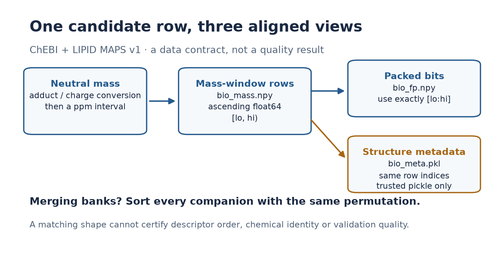
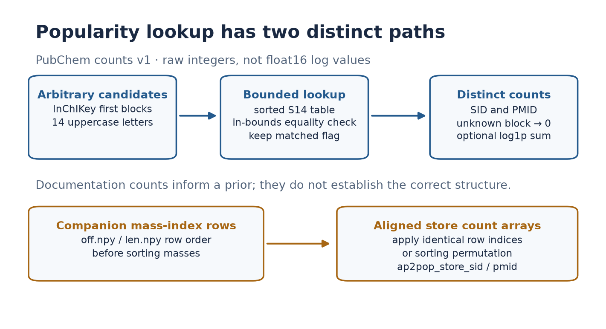

# Two public CASMI resources, easier to use correctly

These are **review-ready, unpublished additions** to existing dataset descriptions. No Kaggle card, file, notebook, GitHub repository, accelerator job or submission was changed by this work.

| Existing resource | Verified description gap on October 9, 2026 | Prepared addition |
|---|---|---|
| [ChEBI + LIPID MAPS](https://www.kaggle.com/datasets/prvsiyan/chebi-lipidmaps-casmi26) | Empty description; 262 notebook attachments and 1,167 downloads | Three-file dictionary, actual mass integrity/range, ppm-window example, packing and row-alignment notes, citations and honest historical-provenance gap |
| [PubChem compound popularity counts](https://www.kaggle.com/datasets/prvsiyan/pubchem-popularity-counts) | 347-character description | Nine-file dictionary, bounded unknown-key lookup, integer/log distinction, companion sorting/alignment guide and concrete reproduction limits |

The numerical starters are original MIT code. They have no network calls, pickle loading, model execution or submission flow.

```bash
python -m pip install numpy
python -m unittest -v test_candidate_starters.py
```

Run those commands in this directory. All 12 focused tests passed on October 9; every test fixture is invented. They specifically cover the missing-after-last-key defect in the previous PubChem card draft, empty tables, duplicate queries, zero-count matches, malformed block rejection, ppm edges, unsorted masses, and packed-bit padding.

For real local inputs:

```python
from candidate_starters import load_popularity, lookup_popularity, load_bio_numerical, mass_window

keys, sid, pmid = load_popularity('/path/to/pubchem-popularity-counts')
print(lookup_popularity(keys, sid, pmid, ['RYYVLZVUVIJVGH']))

mass, packed = load_bio_numerical('/path/to/chebi-lipidmaps-casmi26')
lo, hi = mass_window(mass, neutral_mass_da=300.0, ppm=10.0)
print('bio candidate count:', hi - lo)
```

The mass vector and small PubChem documentation files were actually read from the version-bound public Kaggle resources. The fingerprint header was inspected; the complete fingerprint bank and full popularity arrays were not downloaded. The helper examples do not constitute a chemical-model evaluation.

## Useful diagrams

These original diagrams explain data contracts. They are not scientific performance plots or model-generated artwork.





The SVG versions are supplied for reuse. To reproduce the figures, copy only `draw_contract_diagrams_v3.py` into a new empty directory, install matplotlib, and run `python draw_contract_diagrams_v3.py` there. Keep the existing figures intact. The script refuses to overwrite an existing figure. The earlier visual drafts remain preserved outside the publication allowlist.

## Publication scope

The card text describes the existing dataset versions and retains their current titles, identities and license labels. It must be applied only by the active coordinator after a fresh description/identity/settings/file/version check. No metadata-change command is supplied here.

The ChEBI/LIPID MAPS card explicitly records missing historical build provenance. Do not relabel that existing dataset's license based only on current upstream websites. The PubChem card distinguishes freshly verified small-file hashes from publisher-reported large-array hashes.

Only the explicit publication manifest's payloads are intended for GitHub. Do not publish the full research directory: its API comparison material contains other authors' full card text for internal review. The publication payload contains no weights, spectra, chemical structure table, restricted labels, raw third-party descriptions, signed URLs, credentials or local private paths.
