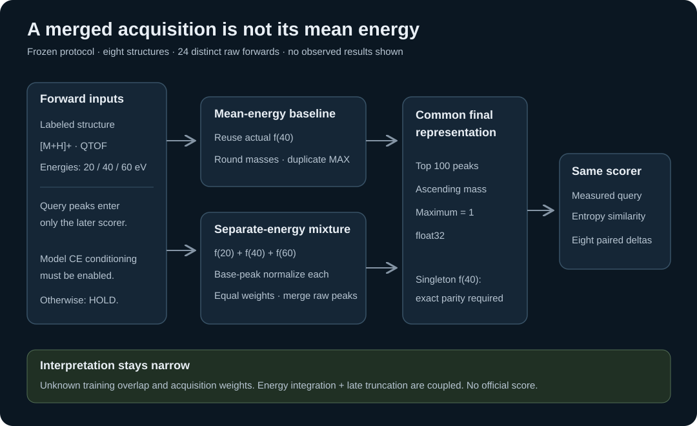

# A merged acquisition is not its mean energy

**Status: 13 CPU component tests pass. The native model experiment has not run. No leaderboard improvement is established.**



A spectrum acquired at 20, 40 and 60 eV contains observations from three acquisitions. Predicting a spectrum at 40 eV is a different operation. For a nonlinear predictor, `f(mean(energies))` need not equal a mixture of `f(energy)` predictions.

This is a small, original experiment motivated by an accessible public method. [Evgen Dvorkin's Version 24](https://www.kaggle.com/code/evgendvorkin/enveda-casmi-2026?scriptVersionId=355344487) displayed a public score of **0.417** when inspected on 2026-10-05. Its released GLACIER runner averages the acquisition energies before prediction. That score belongs to the complete published pipeline; it does not establish the contribution of GLACIER or collision-energy handling alone.

## The frozen comparison

We selected eight structures from [Enveda-180, Zenodo record 21346580](https://zenodo.org/records/21346580), licensed CC BY 4.0. Each has both an observed merged `[20, 40, 60]` spectrum and an observed singleton `[40]` spectrum. All sixteen records use positive ESI, `[M+H]+`, and Bruker timsTOF Pro 2 / Q-TOF measurements. Selection is fixed before inference; it is not a search for favorable examples.

| Choice | Baseline | Proposed mixture |
|---|---|---|
| Model calls per structure | Reuse the actual 40 eV output | Predict 20, 40 and 60 eV |
| Duplicate masses | Round to four decimal places; retain maximum intensity | Same within each energy |
| Energy weighting | One prediction | Normalize each energy to its own base peak; equal weights |
| Peak budget | Final top 100 | Merge all positive raw peaks, then final top 100 |
| Final representation | Ascending mass, maximum-normalized float32 | Same |

The native pilot will make **24 distinct forward calls**, not a separate baseline call for every observation. It reuses the exact raw 40 eV prediction for the baseline and singleton control. Both singleton paths must be bit-identical. The baseline's final processing must also match the pinned released `post` function exactly.

Equal energy weights are an explicit hypothesis: acquisition mixing weights are unknown. The proposed path changes both energy integration and the stage at which peaks are truncated. A favorable result would not isolate those two effects.

## What the CPU tests establish

The NumPy component has thirteen passing tests, independently run by the author, coordinator and reviewer. They cover a nonlinear counterexample, exact singleton parity, released final-processing parity, duplicate-mass handling, a shared final peak budget, input and energy-order invariance, amplitude scaling, malformed output containers, invalid numerical inputs and float32 mass representability.

The CPU test oracle is not the native measurement scorer. Native measurements use the same pinned released query cleaning and entropy similarity for both arms: 0.01 Da / 20 ppm tolerance, the released entropy weighting, and the same query and prediction budgets.

## Gates before a native conclusion

The private pilot uses the publisher-declared open MassSpecGym GLACIER release, with whole-file checkpoint, source and offline-wheel checks. [The model authors publish an open MassSpecGym release and document CPU inference](https://github.com/coleygroup/ms-pred/blob/708148c2a8eb0c32120644436fefd2fe90cd2214/README.md). Independent original-checkpoint byte lineage has not been established, and no model weights are redistributed here.

The actual checkpoint must enable collision-energy conditioning. If it does not, the pilot reports **HOLD with zero forwards**. Loaded tensors must be finite, use the intended precision, and remain on CPU. Measured query peaks and precursor mass never enter model features: the structure, adduct, instrument token and collision energy define a forward call.

The run is capped at 300 seconds of model measurement within 600 seconds overall. Its supervisor must account for partially completed calls, stop the entire worker process session on timeout, preserve all records, and issue an authoritative result independently of the child process's claim.

The panel's overlap with model training data and the checkpoint's training energy coverage are unknown. This is a mechanistic pilot, not a held-out ranking benchmark or an official score. A useful next result is an honest applicability decision and, if all gates pass, eight paired spectral-agreement differences. Competition ranking evidence would require a separate evaluation.

## Reproduce the component

The component needs Python and NumPy. From the directory containing the two original Python files:

```sh
python -m unittest -v test_ce_mixing.py
```

No model, dataset, accelerator or competition credentials are needed for those tests. `ce_mixing.py` deliberately refuses inputs outside the frozen energy protocols. Native execution requires the separately pinned assets and its full run protocol; these component tests do not certify that environment.

Source processing attribution: Ahmed Berat Ozer's `casmi26-glacier` V1 `gl_runner.py`, SHA256 `5c4f74313ac54263d05d987c39d012d81ec57c5f35e1095ecd49a5bcb6440fca`; upstream `coleygroup/ms-pred` commit `708148c2a8eb0c32120644436fefd2fe90cd2214`. Data attribution: Enveda, Enveda-180 (2026), DOI `10.5281/zenodo.21346580`, CC BY 4.0. The schematic illustrates the protocol and contains no measured results.
