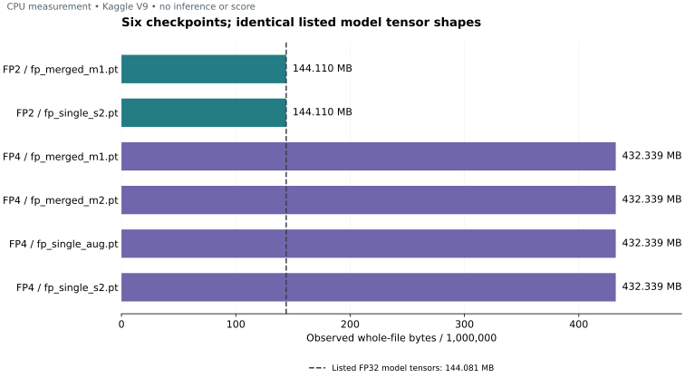
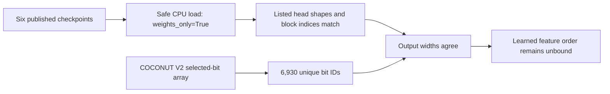

# Six checkpoint contracts, measured on CPU

The six published fingerprint checkpoints in our FP2 V1 and FP4 V1 datasets all report **6,930 outputs, width 512 and six transformer blocks**. Their 87 model-tensor names and shapes agree. The current COCONUT V2 feature map contains 6,930 unique nonnegative `int64` bit IDs.

**Matching output width does not bind the learned feature order.** None of these checkpoints contains `fp_bits`, `feature_bits` or `bit_ids`. This experiment therefore records the ordering contract as unbound. It does not establish numerical compatibility, prediction quality or an official score.

The bars show actual whole-file sizes. Each checkpoint's listed FP32 model tensors contain 36,020,242 elements, or 144,080,968 logical bytes. FP4 also contains an `opt` top-level entry. Optimizer tensor bytes and storage aliasing were not measured; the file-size difference is not an optimizer-size measurement.

## Reproduce the chart

Install Matplotlib, then run `python render.py --output-dir ./new-render`. The script reads the included, unchanged native receipt and creates SVG and PNG files in a new directory. It does not download or deserialize checkpoints. Full observed file hashes and all listed tensor shapes are in [measured-data.json](measured-data.json).

## Exact evidence and limits

This was the private [Kaggle worker](https://www.kaggle.com/code/prvsiyan/zz-gpuchk-844231), **V9 / script355420582**, on October 5, 2026. Its complete native measurement took **30.271306205 seconds**, using PyTorch **2.10.0+cu128 on CPU**, with GPU and TPU disabled, Internet off, a 600-second cap, zero instantiated models and zero inference calls. The full receipt's SHA256 is `9b61a02d3284e167bf4b2b9f216dde1cda077279042daed0f6130e3ac7181e21`.

Sources: [FP2 V1](https://www.kaggle.com/datasets/prvsiyan/casmi26-fp-models-v2/versions/1), [FP4 V1](https://www.kaggle.com/datasets/prvsiyan/casmi26-fp-models-v4/versions/1), and [COCONUT V2](https://www.kaggle.com/datasets/prvsiyan/coconut-casmi26-candidates/versions/2). Fresh public-listing and dataset identity/version checks preceded the run. The selected-bit array matched expected SHA256 `a61e372fc41091bf5c7467e08134081266262665077cb9e2c56d73e4887f3013`. Checkpoint hashes were first observations in this protocol, rather than comparisons against a trusted weight manifest.

The shape checks cover the named projection, normalization and output-head tensors, block indices, and width divisibility. They do not cover every internal shape, strict state loading, weight finiteness, numerical inference or historical training feature order. Original model bodies and notebook identity were preserved; the bodies were skipped for this measurement. No submission was produced.

The referenced FP2/FP4 datasets advertise CC0; the COCONUT derivative advertises CC BY 4.0. These are their observed dataset declarations, not a blanket license assertion for every upstream component. This report redistributes measurements only, with no weights or molecule rows.
