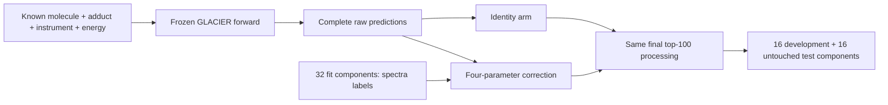

# Four parameters for fragment intensity

**14 CPU math tests pass. The real-data calibration experiment has not run, and no competition score improvement is established.**

GLACIER can predict the right fragment masses while assigning the wrong relative intensities. This original experiment asks whether a small correction can improve those intensities without introducing new fragments or changing the model's inputs.

The correction has four fitted coefficients: a bounded intensity temperature and a bounded mass tilt, each conditioned on collision energy. Zero coefficients reproduce the original relative intensities. Positive temperature preserves support and the winner when several raw peaks occupy the same physical bin. Missing fragments remain missing.



## What is ready

The NumPy component has fourteen meaningful tests, independently executed by the author and coordinator. They check analytic gradients against finite differences, unmatched-peak penalties, unsigned-bin overflow, sorting of Jacobians, numerical scale invariance, replicate weighting, scaffold-connected split behavior and synthetic optimization. Synthetic improvements validate the arithmetic; they are not Enveda measurements.

A fixed metadata-only scan of the first 8,192 rows of the retained [Enveda-180 release](https://zenodo.org/records/21346580) found 778 eligible scaffold components with paired singleton 40/60 eV acquisitions. It froze 64 components and 128 records into 32 fit, 16 development and 16 test components before model outcomes. Components linked to the eight previously inspected structures were excluded. Target-spectrum extraction and native inference are separate checks.

Grouping used RDKit 2026.03.3. Native inference must use the original frozen SMILES and separately pinned runtime; grouping and inference versions must not be conflated. The pretrained checkpoint's structure overlap and energy-training distribution remain unknown.

## Run the math tests

The component needs Python and NumPy. From this directory:

```sh
python -m unittest -v test_calibration_math.py
```

No model weights, dataset, accelerator or competition credentials are needed for the tests. The original [preregistration snapshot](PREREGISTRATION.md) describes the native experiment and its additional gates; it is a record of the pre-native proposal.

## What would change our decision

Freeze the four coefficients using only the fit components, then evaluate the identity and fitted arms on the untouched test components. Use the same complete raw predictions, scorer and final peak budget. Require positive paired test improvement, a positive lower 95% bootstrap bound, and no regression in either energy stratum before broader validation. Development is diagnostic in this first pilot. A failed test must not become training data for another attempt.

Even a successful spectral-agreement result would require a separate competition-ranking evaluation. Enveda-180's drug-like compounds differ from hidden natural products, and a new adapter holdout does not prove the pretrained model never saw those molecules.

This repo contains the original mathematical implementation and tests. It includes no model weights, query peak arrays or teacher trajectories. Source context: [coleygroup/ms-pred, pinned commit 708148c2](https://github.com/coleygroup/ms-pred/tree/708148c2a8eb0c32120644436fefd2fe90cd2214), MIT. Data: Enveda-180, Enveda 2026, DOI 10.5281/zenodo.21346580, CC BY 4.0.
