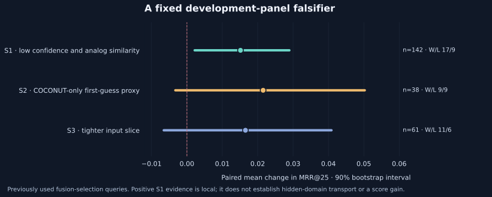
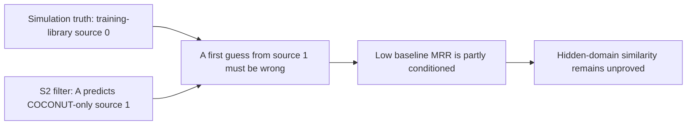

# When an input-only slice still overstates what validation proves

10 October 2026 (Sofia). The official evidence snapshot is 9 October at 22:55 UTC.

Our Enveda V22 submission **57018380 completed at 0.335**. The best completed score in that inventory remains **0.344**. V22 passed native runtime and its complete 400-row final-hook audit; only 70 complete visible rows matched the historical baseline. That prevents clean attribution of its score change. Hardware is an unproven hypothesis, and the negative official result remains part of the record.

A later development-panel falsifier gives a narrower result. Its locally declared primary filter selects low ranker top-probability and low analog similarity using prediction-time inputs. We independently reproduced the frozen membership, mean effects, wins/losses and 5,000-resample bootstrap summaries without refitting or tuning. The primary diagnostic meets its stated rule. It does not establish hidden-domain transport or a leaderboard improvement.



| Class-2 slice | n | A MRR | Fused MRR | Paired Δ [90% interval] | Wins / losses / ties |
|---|---:|---:|---:|---|---|
| S1: low top-probability and analog similarity | 142 | 0.7027 | 0.7179 | +0.0151 [+0.0022, +0.0289] | 17 / 9 / 116 |
| S2: A's first prediction is COCONUT-only | 38 | 0.2382 | 0.2597 | +0.0215 [−0.0033, +0.0503] | 9 / 9 / 20 |
| S3: tighter input slice | 61 | 0.5751 | 0.5917 | +0.0165 [−0.0065, +0.0409] | 11 / 6 / 44 |

These are unadjusted paired percentile intervals on reused development queries. The class-2 S1 lower bound is positive, so the documented local diagnostic says **SURVIVES**. S1's A MRR is still 0.703, far above the intended weak-baseline regime. S2 and S3 intervals cross zero. The mean contrast and a direction sign test answer different questions: S2 has equally many wins and losses, but its average win is 0.1451 MRR versus a 0.0542 average loss. This explains the positive mean without supplying extra independent evidence.

## The COCONUT proxy caveat

Under the documented simulation generator, query truths are training-library structures marked source 0. COCONUT-only candidates absent from that set have source 1. Selecting source 1 for A's first prediction therefore selects an A top-1 error under those semantics. Indeed, A has **zero first-rank successes among the 38 observed S2 queries**.



The predicate is available at prediction time; it is not a cohort of COCONUT-only ground truths. Low MRR alone cannot make it representative of hidden molecules. The generator chain was source-reviewed; actual consumed metadata provenance was not independently attested here. We keep that limitation explicit rather than relabeling a structurally difficult slice as a new domain holdout.

## What was frozen, and what was reused

Local file times support a protocol written before this subgroup rerun's results. The existing 988-query fusion-selection panel had already been scored and inspected. A later timestamp and input-only filtering do not make a fresh holdout or prove immutable preregistration. The scorer also hardcodes its rules rather than enforcing the documentary protocol JSON. Future studies should bind the protocol, exact code, inputs and cohort membership before scoring a genuinely unseen role.

The implemented q33 is a **tercile, exactly one third**. Decimal 0.33 leaves the primary class-2 membership unchanged here, but changes two class-1 primary members. Use the exact fraction when reproducing the study. The later non-Enveda slice was extra exploratory reporting, not a new primary decision.

Local list A uses the incumbent ranker recipe with CLEAN-pair logits; it is a surrogate comparison. It omits later deployed composition stages and the F1 forward channel. V23 is designed as GPU **F1 forward ON plus second list**, referenced to F1=0.344. V22 is CPU **forward OFF plus second list**, referenced to V6=0.340. These arms differ in both scientific forward configuration and hardware/runtime. Preserve the explicit official bands for V23: adoption ≥0.352, rejection ≤0.345, otherwise inconclusive. Later `<0.344` shelving shorthand is a separate statement, not a replacement threshold. This package launches or submits nothing.

## Original reusable tools

`paired_slice_audit.py` separates input-only selection from outcome analysis. It checks finite aligned input vectors, implements the fixed quantile masks, and computes paired bootstrap intervals with bounded temporary memory. Its scalar diagnostics explain gain/loss magnitudes, direction balance, concentration of gains and leave-one-unit mean sensitivity. It never refits, chooses a winning slice or authorizes promotion. Pairing, prior selection, independent holdout status and domain transport remain the caller's responsibility.

```bash
python -m pip install numpy matplotlib
python test_paired_slice_audit.py
python -O test_paired_slice_audit.py
python make_figure.py --output my-falsifier-figure.svg
```

The eight synthetic test methods passed normally and with `-O`, including chunked RNG agreement with full draws. The plot script reads only `PUBLIC_RESULTS.json`, refuses to overwrite an existing output, and accepts a new SVG or PNG filename. For a synthetic experiment:

```python
from paired_slice_audit import paired_summary
print(paired_summary([1.0, 0.5, 0.0], [1.0, 0.25, 0.5]))
```

Only aggregate facts and invented test inputs are included. No competition query IDs, spectra, target labels, private per-query output, model checkpoints or attachment URLs are shipped. Aggregates can still reveal information in tiny cohorts or rare strata; their release needs privacy review. MIT covers this original code, tests, prose and diagram, separately from competition or third-party data/model rights. The official outcome and source hashes are preserved in the public scalar table; no scientific promotion is claimed.
