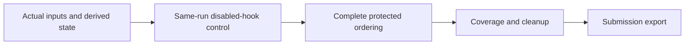

# When a valid submission is still the wrong control

On 9 October, our verified Enveda best was **0.344**; the corrected-data control was **0.340**. The next second-list experiment completed its scientific worker and cleanup, but its parent correctly refused to export the submission because the visible control did not reproduce.

The diagnostic is specific: all 400 visible library gates were closed, so popularity, forward scoring and second-list fusion were inactive. First guesses were unchanged, but **330 complete candidate lists changed**, including **160 changed candidate sets**. Those differences remained after stereo removal and tautomer-based semantic comparison. Valid CSV formatting and a passed model canary did not prove baseline fidelity.

We have not attributed the differences to hardware, packages, or the new model. The reported package versions and declared pins matched. The missing evidence is the binding of actual consumed files and derived candidate/library state. The experiment remains on HOLD; these tools do not certify a leaderboard improvement.

## Original tools

- `protected_replay.py`: compares the complete protected candidate ordering to a disabled-hook control on the same inputs and runtime. Changed gate-open candidates are allowed only in declared experiment mode; exact-control mode protects all queries. Scientific exceptions, missing coverage and diagnostic inconsistencies hold the receipt.
- `consumed_input_bindings.py`: hashes files at the actual loader path, derived plain numeric arrays and ordered string sequences. It emits no paths or data. Complete coverage requires an explicit expected-role manifest; matching only observed roles is insufficient.
- `test_protected_replay.py`: invented positive and negative cases, including mutable-result aliasing, broken diagnostics and exceptions. It runs without any competition data or model.

These are **source-only utilities**. Existing replay tests passed normally and with `python -O`; a separate review exercised 28 additional synthetic cases across the utilities. The production integration must still verify loader provenance, double-call side effects, numerical state, timing, source binding, and owned cleanup. Keep historical outputs as diagnostics rather than silently dropping a failed control.



Run the portable replay cases with:

```bash
python test_protected_replay.py
python -O test_protected_replay.py
```

The utilities require NumPy only for numeric bindings; no checkpoint, spectrum, target label, private query identifier or competition attachment is included. Code is original and MIT-licensed. Competition and third-party data/model rights are separate from this code license.
