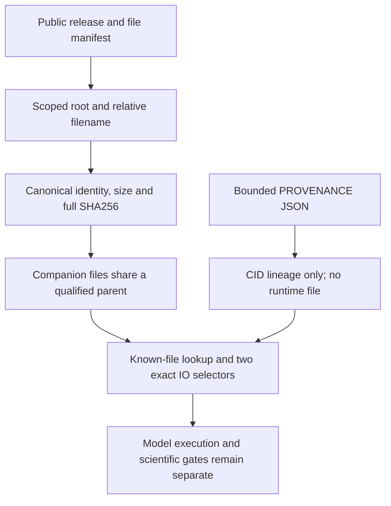
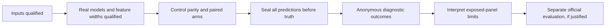

# Run and adapt the source-binding helper

## 1. Run the small demonstration first

Use Python 3.10 or newer. The demonstration creates a fresh directory of tiny
synthetic files. It checks four cases: one scoped source, two aliases of the same
canonical source, two distinct physical copies, and a mismatching digest. The
first two pass; the latter two fail. The demo prints no physical mount paths.
The tests also exercise the lookup bridge without loading an actual model.

```sh
python3 synthetic-demo/demo.py
python3 -m unittest discover -s synthetic-demo -p test_demo.py -v
```

## 2. Pin a dataset release and its bytes together

Attach the five active public dataset releases listed in `INPUT_CARDS.md`.
Do not replace v2 fingerprint checkpoints with v4 files sharing their names.
The version pins select the intended release; the complete file SHA256 and size
verify its bytes. A mount name alone does not prove a version. The manifest
contains expectations from the reviewed campaign source and provenance;
it is not a receipt that your current environment passed.

The helper accepts these two explicit layouts:

```text
<input-root>/datasets/<owner>/<dataset-slug>/<relative-file>
<input-root>/<dataset-slug>/<relative-file>
```

They are permitted layouts rather than an assertion that Kaggle exposes both.
For local use, arrange extracted public files in one of those layouts under a
new directory, then pass that directory as `--input-root`. Preserve dataset
version records outside the mount. Do not move or overwrite existing notebook
directories to make the example work.

```sh
python3 verify_public_inputs.py --input-root /kaggle/input
# Local example: a directory containing datasets/<owner>/<slug>/...
python3 verify_public_inputs.py --input-root ./public-inputs
```

The resolver opens only a declared scoped file, resolves aliases, proves root
containment, checks size, streams its full SHA256, and rejects path drift.
Two declared layouts resolving to one canonical path are accepted. Two distinct
canonical files are rejected even when their bytes match. Missing sources,
wrong-dataset-only sources, changed hashes and split companion directories fail.
There is no recursive basename fallback or “take the first match” behavior.

## 3. Preserve companion alignment

The bridge checks four families: COCONUT arrays/metadata/bit-selection indices,
PubChem mass/offset/order/SMILES files, popularity count companions, and the two
fingerprint checkpoints. Each family's sibling reads must resolve to the
already qualified files under one canonical parent. A correct anchor alongside
an unrelated sibling is not sufficient.

COCONUT fingerprints are packed bytes whose row order must match the mass and
metadata arrays. The ranker archive has 31 candidate-relative features: changing
a candidate list changes ranks, maxima and z-scores. The earlier dataset cards
explain the measured headers and feature order. This helper deliberately checks
bytes rather than pretending to validate scientific semantics from a filename.

## 4. Keep runtime inputs separate from build lineage

The published mass-index release contains five consumed files. Its CID map is
not published in that dataset. The popularity dataset's pinned, bounded
`PROVENANCE.json` explicitly records the local CID alignment map and its digest.
The bridge checks those exact provenance bytes and alignment hashes. It never
searches for, exports or mounts a replacement `cid.npy`.



## 5. Integrate the checked paths at the executing entrypoint

Import the modules normally so Python registers their module state. The return
value of `qualify_mounts(...)` supplies canonical paths privately and sanitized
receipts separately. `bind_known_find(...)` redirects only the 18 known file
names and leaves other calls with the original finder. The two exact selector
changes handle original fingerprint and mass-index glob expressions. The
transform requires exactly one matching expression; it fails on changed source.

Those source changes affect input selection, not a scoring formula. Preserve
the original scientific source hash and record the executed-source hash
separately. Appending a new function beneath a notebook that still executes a
different mounted script does not integrate an experiment.

## 6. Qualify the actual experiment before reading its metrics

Source verification alone does not prove that the models ran. The actual V18
study separately requires its pinned environment, real 6,930-bit model logits,
eight serialized 31-feature rankers, same-run reference-library hash, original
control parity, joined workers, owned bounded teardown, and 16 sealed results
before truth access. Forward and second-list channels stay disabled in both
arms. Its CPU server cap is 7,200 seconds; the inclusive process deadline is
7,130 seconds. These are configured limits, not a promise of completion.



The 16-query panel has been exposed in prior research. Even a positive paired
delta is a development diagnostic, not held-out performance or an official
leaderboard score. This package sends no Kaggle write or competition submission.
