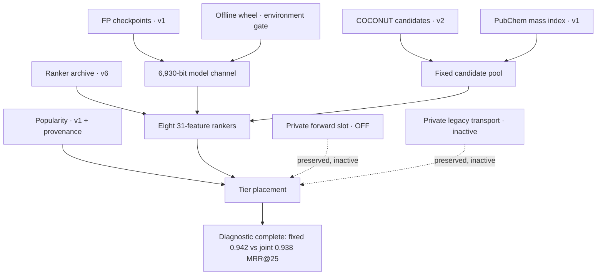

# Eight preserved inputs: what each slot actually does

The V18 source repair keeps all eight attachments. Five public datasets provide
the 18 consumed files in `input-contract.json`; a public wheel supports offline
package installation; two private slots are retained without publishing their
identities or payloads. These cards describe the attachment contract rather
than updating Kaggle dataset descriptions. The earlier published dataset cards
remain [available at their original commit](https://github.com/cubres/enveda-casmi-2026/tree/565aa34c39447bc822ed21449d8b8990230d4d9e/dataset-cards-2026-10-07).

| Slot | Resource | V18 selection | Consumed-file contract | License metadata |
|---:|---|---|---|---|
| 1 | [Fingerprint v2](https://www.kaggle.com/datasets/prvsiyan/casmi26-fp-models-v2) | Data v1 | Two exact checkpoints | CC0-1.0 |
| 2 | Preserved private forward-reference slot | Attached; forward channel OFF | No file consumed by this study | Private; terms not published here |
| 3 | [Ranker features](https://www.kaggle.com/datasets/prvsiyan/casmi26-ranker-features) | Data v6 | One archive; 31-feature builder alignment required | CC0-1.0 |
| 4 | [COCONUT candidates](https://www.kaggle.com/datasets/prvsiyan/coconut-casmi26-candidates) | Data v2 | Four row-aligned files | CC BY 4.0 |
| 5 | Preserved private legacy transport slot | Attached; inactive | No payload distributed or read by this helper | Private; terms not published here |
| 6 | [PubChem popularity counts](https://www.kaggle.com/datasets/prvsiyan/pubchem-popularity-counts) | Data v1 | Six consumed files plus bounded provenance | CC0-1.0 |
| 7 | [PubChem mass index](https://www.kaggle.com/datasets/prvsiyan/pubchem-npformula-massindex) | Data v1 | Five coherent search/alignment files | CC0-1.0 |
| 8 | [Offline RDKit wheel](https://www.kaggle.com/datasets/prvsiyan/rdkit-wheel-offline) | No explicit version selector; inventory observed data v1 | Package/environment gate; outside the 18-file data manifest | Other, specified in description; terms incomplete in inspected metadata |

Public/private flags, license labels and selected public inventories were
observed on October 7, 2026. A Kaggle license label does not certify all upstream
training-source terms. This package distributes helper source and manifests,
not dataset or checkpoint payloads. Attachments without explicit version pins
are identified as such; the current metadata is not a historical byte pin.

## 1. Spectrum-to-fingerprint checkpoints

The data-v1 bundle contains `fp_single_s2.pt` and `fp_merged_m1.pt`, each
144,110,255 bytes. Recorded checkpoint metadata specifies 6,930 output bits,
width 512 and six layers. The single and merged branches retain their matching
preprocessing and selected fingerprint order. The full expected digests in
`input-contract.json` distinguish this release from identically named files in
other bundles. The source-binding helper hashes bytes without executing pickle
or loading weights. A compatible output width alone does not prove compatible
descriptors, preprocessing or generalization.

## 2. Private forward-reference slot

This pre-existing attachment is preserved. Both matched arms have the forward
channel disabled. Its presence therefore supplies no evidence of additional
model inference or a stronger candidate pool. Its exact private reference,
inventory and payload are excluded from this public helper package.

## 3. Candidate-level ranker features

`rank_train.npz` from data v6 is 9,553,020 bytes and has a full expected SHA256
in the manifest. Independently inspected headers establish `X` as float32 with
shape `(142762, 31)`, and `Y`, `M`, `G` as aligned one-dimensional arrays. These
are candidate-level features and training selectors; headers do not establish a
certified query/structure grouping map or held-out split. Preserve the matching
31-feature builder and complete candidate lists. V18 refitted the eight models
from this archive and reproduced the pinned ensemble hash; the reusable helper
does not inspect targets.

## 4. COCONUT candidate bank

Data v2 contains `coco_mass.npy`, `coco_fp.npy`, `coco_meta.pkl` and `fp_bits.npy`.
The published card records 436,389 rows, float64 masses, packed uint8
fingerprints of shape `(436389, 867)`, and 6,930 selected bit indices. Preserve
row order across all companions, descriptor order and bit packing. The exact
source contract hashes all four files and requires one canonical family parent.
It does not certify complete molecular coverage or stereochemical identity.
Attribute COCONUT and retain its CC BY 4.0 terms when using derived assets.

## 5. Private legacy transport slot

This old attachment remains intact while the active runner uses its reviewed
entrypoint. The reusable binding package neither distributes nor reads that
private transport. Keeping an attachment is separate from proving that an
active scientific code path consumes it. No private query identities, matrices,
targets or experiment transports are published here.

## 6. PubChem popularity counts and alignment provenance

Data v1 supplies `ap2pop_manifest.json`, the `ap2pop_ik14` identifier/count
companions and the `ap2pop_store_sid` / `ap2pop_store_pmid` companions. Six runtime
files are individually pinned and must share the qualified parent directory.
Their alignment is part of the consumer contract; do not use counts from a
different store release merely because their filenames match.

The separate, 3,762-byte `PROVENANCE.json` is bounded and fully hash-checked.
Its `store_alignment_source.cid_map` says `cid.npy (local only, not part of that
dataset)`. The builder CID digest and published `len.npy`, `off.npy`, `order.npy`
digests are retained as lineage. The helper never asks for a mounted CID file.
Popularity is a ranking prior, not evidence that a molecular identification is
correct; its tuning must be assessed separately from retrieval coverage.

## 7. PubChem natural-product-formula mass index

Data v1's complete published inventory has `mass_sorted.npy`, `order.npy`,
`off.npy`, `len.npy` and `smiles.txt`. These five files are pinned together.
The original consumer searches the mass array and reads aligned structure
records using its offset/length/order convention. Do not reorder one component
independently. `cid.npy` is absent from this release's inventory and belongs to
builder provenance, not runtime retrieval. This distinction is the concrete
reason V17 failed before models ran and the narrow source correction in V18.

## 8. Offline RDKit installation

The public wheel resource is titled “RDKit 2026.03.3 wheel for offline install.”
The complete owned metadata inventory observed data v1, but the worker's
attachment is unversioned. The package lies outside the 18 data-file byte pins;
the native study separately gates the actual RDKit version before interpreting
fingerprints. The synthetic helper uses only the standard library and requires
no RDKit wheel. The inspected license label is “Other (specified in description)”
while the description is absent, so redistribution terms remain unqualified.
No wheel is copied into this package.

