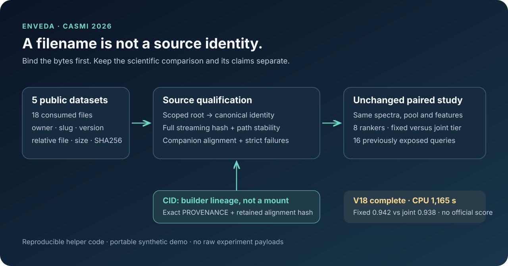

# Enveda source binding: the right bytes, from the right dataset

Version 18 of our existing private research worker was accepted during the
launch recorded on October 7, 2026 from 22:52:55 to 22:53:11 UTC and finished
**COMPLETE** on CPU: 1,165 s of owned compute inside a 7,130 s budget, with the
process-group teardown proven. All 18 consumed files matched their contracts on
the mount layout actually present (`/kaggle/input/<slug>/`), and the eight original
31-feature rankers refitted to the pinned ensemble hash. The matched diagnostic is
done: fixed tier placement scored MRR@25 **0.9417**, joint placement **0.9375**
(mean paired change −0.0042) on 16 previously exposed public queries. Joint
placement was not promoted. There is no new official score.



A filename is not a source identity. A notebook can attach several datasets
containing `fp_merged_m1.pt` or `mass_sorted.npy`; a recursive search may select a
different checkpoint or return the same physical mount through two aliases.
The original helper code here binds each consumed file to an owner, dataset,
version, relative filename, byte size and full SHA256 before any model is loaded.

## Try the reusable part

```sh
python3 synthetic-demo/demo.py
python3 -m unittest discover -s synthetic-demo -p test_demo.py -v
python3 verify_public_inputs.py --help
```

The demo and tests use tiny synthetic files and the Python standard library.
They need neither Kaggle credentials nor the campaign inputs. For the actual
public-input byte check, attach the pinned data versions described in
[the input cards](INPUT_CARDS.md), then run:

```sh
python3 verify_public_inputs.py --input-root /kaggle/input
```

This last command streams several gigabytes to verify complete hashes. It does
not deserialize checkpoints, inspect training targets, train models, generate
rankings or submit a competition file. See [the complete guide](HOW_TO_RUN.md)
for mount layouts, local use and the separate scientific qualification gates.

## What the actual run is testing

The comparison held the spectra, candidate pool, features, eight 31-feature
rankers and forward/second-channel settings constant, and compared fixed tier
placement with joint tier placement on 16 previously exposed public development
queries. Both complete rankings were sealed before the public truth was parsed.
Fourteen queries had a strong library match, so the PubChem tier stayed closed and
both arms were identical. Of the two open queries, one kept its answer at rank 1
and one lost it: when the rankers scored the PubChem proposals jointly with the
pool, proposals took 21 of the 25 positions and displaced a pool answer that fixed
placement had kept at rank 15. The metric is diagnostic only; these queries cannot
support a claim of held-out generalization.

Version 17 failed before the study because its preflight incorrectly required
mounted `cid.npy`. The dataset's exact provenance describes CID as a local-only
builder alignment map. Version 18 checks the 18 published consumed files and
that provenance, retaining CID's original lineage hash. No input attachment or
notebook version was removed.

## Files and evidence

| File | Purpose |
|---|---|
| `input-contract.json` | Expected 18-file byte contracts and builder-only CID lineage |
| `scoped_mount_resolver_v2.py` | Reusable inert resolver; canonical aliases are deduplicated |
| `native_mount_bridge_v5.py` | Companion coherence and exact two-selector integration |
| `verify_public_inputs.py` | Public input verification without model execution |
| `synthetic-demo/demo.py` / `synthetic-demo/test_demo.py` | Portable synthetic examples and tests |
| `INPUT_CARDS.md` | The eight preserved attachment roles and license limits |
| `progress-snapshot.json` | Sanitized completed state, aggregate diagnostic metrics and evidence boundaries |
| `HOW_TO_RUN.md` | How to adapt the contract and reproduce source qualification |

The original V18 runner and notebook contain private experiment transports and
are not distributed in this helper package. No matrices, spectra, query IDs,
targets, weight payloads, signed access URLs or raw process logs are included.
This package makes the input-binding component reproducible; it is not a full
scientific-run reproduction or a new scoring notebook.

The existing [Analog Propagation public notebook](https://www.kaggle.com/code/prvsiyan/analog-propagation-casmi-2026-baseline)
and [dataset cards published earlier that day](https://github.com/cubres/enveda-casmi-2026/tree/565aa34c39447bc822ed21449d8b8990230d4d9e/dataset-cards-2026-10-07)
remain separate references. Their files and history are preserved.
