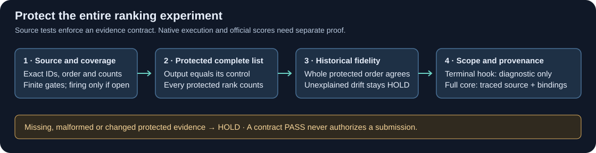
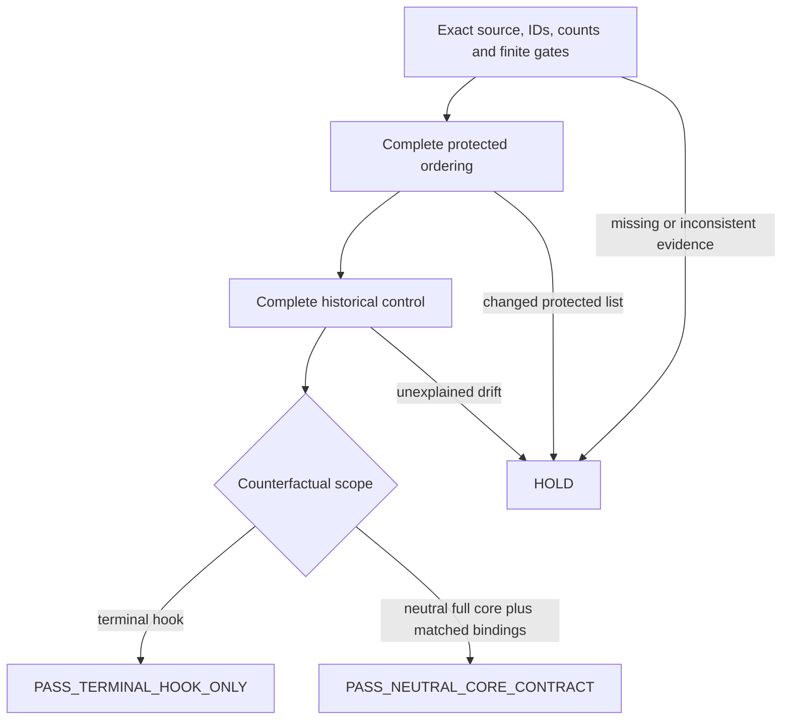

# Protect the whole candidate list

A valid CSV and unchanged first guesses can still hide a changed ranking experiment. This original audit module checks complete protected ordering, every expected row, and the exact scope of its reference. It uses Python's standard library and runs without competition data, model weights or a network connection.

The motivating Enveda V22 run completed its native worker and exported a CSV. Its measured parent runtime was **3,934.8 seconds**, cleanup passed, and all 400 terminal second-list counterfactuals matched. However, only **70 of 400 complete rows** reproduced the historical baseline; all 400 first guesses matched. Second-list firing was zero. The native receipt proves runtime and terminal-hook parity. Full neutral-core equivalence remains unresolved, and no hardware cause is established. The associated new official submission's score was still unknown in the coordinator's latest snapshot; this package claims no score gain.



## Use the module

```bash
python test_strict_protection.py
python -O test_strict_protection.py
```

Both commands passed the 16 test methods and their malformed-input subcases. Fixtures contain invented identifiers and small invented molecular strings only.

`validate_protection()` takes the ordered submission IDs, complete emitted candidate lists, a source-bound audit, the finite library threshold, and the historical reference lists. Records must cover exactly those IDs in the same order. Each has a finite `lib_max`, boolean `gate_open` and `fired`, and complete `output` / `counterfactual` lists. Protection follows the measured library gate; a firing claim cannot exempt a protected row. Full historical ordering is required for the full-core contract on every device. An explicit historical waiver is limited to a terminal-only diagnostic and cannot produce a full-core contract PASS. A declared exact-control experiment also protects gate-open rows.

The default required scope is `neutral_full_core`. A full-core contract additionally needs the exact control-source hash and a complete frozen input/derived-state hash map matching both control and changed arm. Hash those values at the actual loader and stage sites. A caller cannot turn a last-stage replay into a full-core replay by relabeling it.



`PASS_TERMINAL_HOOK_ONLY` describes a terminal diagnostic. `PASS_NEUTRAL_CORE_CONTRACT` means the supplied full-core evidence meets the contract. **Neither status authenticates remote execution, proves that a declared trace was actually generated, or authorizes a submission.** Trusted integration must bind the actual run/source/control, prove independent neutral-core execution and consumed-input coverage, then retain schema, numerical, runtime, quota, privacy, cleanup and frozen scientific adoption gates.

The preserved owned `protected_replay.py` can enforce same-run final-hook ordering while a commit diagnostic runs. It snapshots the control result, restores the hook flag, rejects exceptions and diagnostic inconsistencies, and exports scalar coverage. This remains a terminal-function replay until the integration supplies a genuinely traced neutral core. Keep full candidate/control records in private memory or private receipts; export only the scalar validator receipt. Existing V22 hash-only row records cannot be upgraded by inventing missing counterfactual lists or assuming each equals its output.

## What the regressions cover

Empty and partial audits hold; a fired claim on a closed gate holds; changed second or later guesses hold even when first guesses match; a faithful final-hook counterfactual with changed historical ordering holds. Tests also cover finite gate evidence, inconsistent counts, duplicate/extra/misordered IDs, missing controls, source/role-hash drift, malformed records, explicit changed-arm versus exact-control behavior, scope labels, and scalar receipt privacy.

Code, tests and diagrams are original and MIT-licensed. The owned replay utility is preserved byte-for-byte with its provenance hash. No competitor code, competition query IDs, spectra, target labels, private outputs, checkpoint bytes or attachment URLs are included. Competition and third-party data/model rights are separate from this code license. This is a reviewed source tool, not a native integration or leaderboard result.
