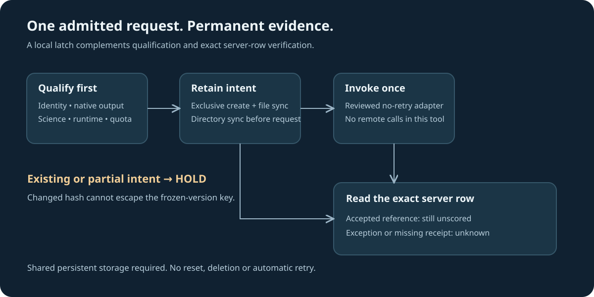

# One request, then reconcile the exact row

A server can accept a competition upload before the local caller loses its connection or fails while writing its receipt. Repeating that mutation consumes another daily slot and makes experiment attribution ambiguous. This original local intent latch preserves evidence before invoking an already-qualified request adapter. It contains no Kaggle API, credentials or network operations.



Use Python **3.10 or newer** on trusted persistent POSIX storage. The recorded controls used the campaign's Python environment; an older system Python may reject the type annotations.

```bash
python -B test_one_attempt.py
python -O -B test_one_attempt.py
```

All 14 invented-fixture test methods passed in both modes, including two racing callers, changed file names and artifact hashes, case aliases, partial intents, sync failure, interrupted requests and post-request receipt failure. Fixture directories are retained; this package has no deletion or reset operation.

## Use after qualification

```python
from pathlib import Path
from one_attempt import Binding, IntentStore, request_once

binding = Binding("your-competition", "owner/existing-slug", 7,
                  "submission.csv", actual_verified_artifact_sha256)
store = IntentStore(Path("retained_submission_intents"))
# Only supply an independently reviewed adapter after all qualification gates.
# It must have transport retries disabled and return the accepted row reference.
receipt = request_once(store, binding, qualified_request_adapter)
```

The permanent key binds competition, owner/slug and frozen version. Exact file name and artifact hash are recorded as evidence but deliberately excluded from the key: changing either cannot authorize another upload of the same frozen notebook version. Competition/reference case aliases use the same key. A different version has a different identity and still requires fresh qualification and authorization.

An exclusive intent file is written and synced, and its directory is synced, **before** invoking the adapter. Existing intents hold, even when partial or lacking an outcome receipt. The adapter is called once. A positive numeric accepted reference yields `ACCEPTED_UNSCORED`; it is not a completed score. An exception, interruption, invalid/missing reference or receipt failure yields HOLD/UNKNOWN. Every subsequent invocation with that identity holds. Reconcile the exact server row read-only; never clear a latch to retry an unknown mutation.

The supplied binding and returned reference are caller declarations. This tool does not authenticate the account, bind remote source or native output, enforce runtime/quota, prove scientific value, validate a CSV, enumerate prior server rows, or verify a completed official score. Those gates remain mandatory before admission and during read-only reconciliation. The local store must be on trusted persistent storage with working exclusive-create and file/directory sync semantics. Hostile filesystem changes, lost storage and distributed callers using different stores fall outside this contract. File syncing is not a wall-time guarantee. Internal retries inside a callback or network client are also outside the latch; disable them explicitly.

## Why this tool was written

A source review of the existing campaign upload helper found that its same-version duplication check only considered raw rows whose status field was absent. It did not cover every accepted status, and it wrote its main receipt after the request and subsequent status fetch. One associated runner retried failures. An accepted request followed by a local exception could therefore reach another attempt when the accepted row was not caught by that narrow check. This is a proven source-level retry path, **not evidence that a duplicate actually occurred**. No upload was executed to demonstrate it, and the coordinator's files were not changed.

For integration, the coordinator must bind every existing accepted row for the same version/file regardless of status, complete fresh source/native-output/scientific/quota checks, persist a shared permanent pre-request latch, use a no-retry adapter, and stop on an unknown outcome. This package is source-only until that integration is independently reviewed. It does not authorize a submission or override notebook-preservation protections.

An independent review of the first draft found that a changed file name could create a second key. This R2 version uses a version-wide latch and adds that regression control. The original draft is retained locally as a failed design attempt; it was never integrated or used for a real request.

Source, invented controls and diagram are original and MIT-licensed. No competition data, model weights, private task payloads or competitor implementation are included.
