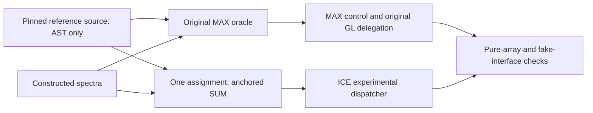

# One aggregation change, with the original reducer contract

This portable bundle checks an original source-only ICE postprocessing ablation.
It has not loaded real models, served a native request, run on an accelerator,
produced competition candidate rankings or been submitted. It needs no private
data for its default tests.

The inert source reference is `accepted_fwd_runner.py`, SHA256
`622d576e47fb6405b73a1ef2d400f97fefab4017a2ba6fccef406e4334c057d4`.
Neither the verifier nor the dispatcher imports it as a module or invokes its
entrypoint. Six explicitly allowed function definitions are AST-extracted and
compiled; the Models class, installer, activation and main function are excluded.

The ICE scientific core changes exactly
`it[-1] = max(it[-1], v)` to `it[-1] += v`. The original core's docstring
is deliberately retained in the extracted file to keep the one-line diff exact;
that docstring describes the original MAX oracle, while the changed assignment
performs SUM. MAX control and experimental GL delegation use the original core.

Everything else in the reducer stays original: float64 coercion/reshape,
finite-positive row filtering, stable mass sorting, comparison to the first
mass in each group using `<= 0.001` by default, first-mass representative,
stable intensity top-k selection, sorted selected mass indices and FP64 L1
normalization. The grouping is anchored rather than a transitive nearby-peak
chain. No four-decimal grouping or float32 normalization is introduced.
SUM can change the selected top100 support because it changes strengths;
the selection and tie rules themselves remain unchanged.

## Explicit experimental overflow restriction

The scientific core is one assignment different. Outside that core, the SUM
wrapper adds an eligibility guard: nonempty output with nonfinite probabilities
or failed L1 normalization raises `FiniteSumOverflowHold`. This catches
finite-input group-addition and normalization-denominator overflow in the tested
cases. It supplies no scores and never switches to MAX, drops groups or rescales
invalid output. The original MAX control retains its original behavior.

Ordinary finite, non-overflow inputs are the scientific comparison domain.
Original malformed reshape/type errors propagate. Arbitrary coercions, invalid
tolerance/top arguments, every subnormal range and every possible coordinate
overflow are not certified by these tests.

## What is checked

The default verifier checks 513 ordinary cases: 13 named grouping/boundary/filter
cases, 250 collision-free exact-parity cases and 250 known duplicate-SUM cases.
It additionally checks two explicit overflow HOLD cases and three malformed
shapes. A constructed prediction-interface stub exercises both channels through
the pinned score_item function: 12 unchanged candidate/condition jobs, identical
call arguments and raw arrays, unchanged GL scores and only one changed ICE
candidate containing duplicates. This is a stub with no learned parameters;
the test does not exercise native JSON serving or same-formula fusion.

The optional CCO canary is omitted from the bundle. If supplied, its exact hash
is required and two previously retained synthetic spectra are added. Without
it, the JSON explicitly reports `UNAVAILABLE_NOT_SUPPLIED`; that is not a claim
of passing native-canary evidence. The checked-in optional report documents the
historical replay, not a promise that the file is publicly available.

## Bounded serving-readout proposal

A future native integration check should freeze a small constructed, label-free
two-channel request and retain source/environment bindings, ready state, actual
ICE/GL reducer counts, complete finite arrays of the original candidate length
and completion within original request limits. Compare MAX and SUM with all
candidate order, measured spectra, conditions, model/input pins and raw predicted
arrays identical. Observe raw and standardized ICE differences, unchanged GL
scores and movement within existing formula slots and the final metric-class
list. Include a group of at least three same-formula candidates and a two-member
control; the current fusion can mask changes in two-member groups.

Do not open the library gate or broaden candidates to manufacture exposure.
All 400 queries in the previously observed visible V16 run had the gate closed;
this portable fixture does not prove eligible hidden exposure. Successful
mechanical integration would establish execution, not ranking-quality gain.

This is a proposal only. No native protocol, driver, notebook packet, dataset,
model assets, downloads, installs or run is included. Collision-energy
conditions/averaging, entropy scoring, model calls, candidate construction,
formula fusion, weights, caps, budgets and fallbacks remain unchanged.
The closed corpus, calibration and full-metadata workflows are not reopened.

Original source attribution and the Coley-group ms-pred MIT credit are retained
in `ATTRIBUTION.txt` and the unchanged reference header. Exact source and report
hashes are recorded in `PROVENANCE.json` and `FILE_MANIFEST.json`.
