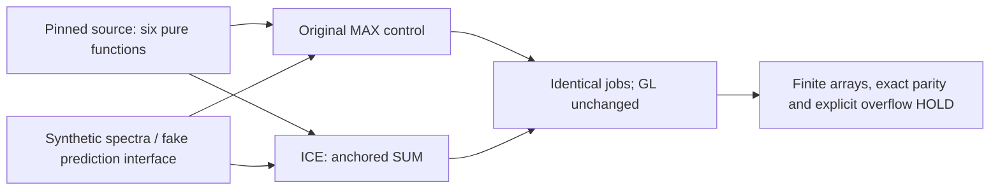

# Anchored ICE SUM: one controlled aggregation change

Predicted spectra can contain several positive peaks inside one anchored mass
group. This tool compares retaining the largest intensity (MAX) with adding
those intensities (SUM). The grouping, representative mass, top-100 selection
and FP64 normalization rules stay fixed. GL uses the original reducer.



Run with Python and an existing NumPy installation:

```bash
python3 -B verify_anchored_sum.py
```

The default suite needs no private data, weights, Torch, RDKit, network or Kaggle.
It checks 513 ordinary synthetic cases, two overflow HOLD cases, three malformed
shapes and a constructed two-channel prediction interface. Optimized Python
mode is rejected because the verification uses assertions. Results go to stdout;
the verifier writes no files.

The accepted runner is an inert source reference. Only six pinned function
definitions are AST-extracted. Its Models class, installer and entrypoint are
not imported or executed. The experiment changes one reducer assignment and
one channel-dispatch call site; the accompanying diffs expose both changes.

[Design, boundaries and limitations](DESIGN_AND_LIMITS.md) explains anchored
groups, possible top-100 support changes and the additional overflow guard.
[Usage](USAGE.txt) covers the optional hash-checked synthetic CCO replay; that
canary is absent from this public bundle and is not needed for the default tests.
[Provenance](PROVENANCE.json) and the manifest pin every source and report.

These checks establish postprocessing mechanics. Native serving, hidden-query
exposure, formula-slot movement and official score improvement remain unverified.
The native V16 experiment is distinct because it also changed grouping and
floating-point rules; it is not evidence for this one-change control.

Original project code is credited in the retained runner header; the referenced
Coley-group ms-pred model software is credited in [ATTRIBUTION.txt](ATTRIBUTION.txt).
No model code, checkpoints or dataset are distributed here.
