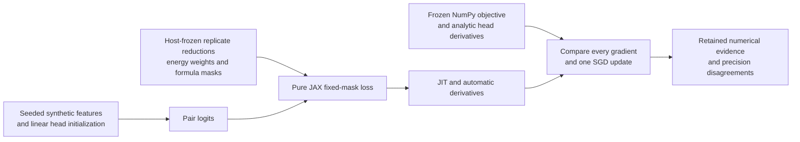

# Energy-balanced projection in pure JAX

This component checks a fixed-mask JAX loss and its automatic derivatives
against an independently implemented NumPy numerical authority. It is a small
CPU experiment that can be reproduced before adapting the equations to a
different backend.

This artifact is a bounded subprocess study. Importing
`jax_projection_parity.py` sets the process CPU resource limit and alarm, and
changes global JAX x64 and matrix-precision settings. Execute the study through
`run_study.py` in its isolated child process. The kernel equations are useful
references; trainer or library integration needs a separate reviewed wrapper
that avoids those import effects on a long-lived process.

The spectral and molecular heads are original dense linear maps without biases:
1024 to 256 and 768 to 256. Their dot-product logits are divided by 16. The
synthetic packet contains seven identities in complete formula groups of sizes
3, 2 and 2, with 22 active spectral rows, three padded rows and two padded columns.
Unequal replicate counts and missing collision energies are intentional.

The objective first averages replicate logits within each observed energy.
Half the loss is cross-entropy after averaging those energy means; the other
half is average cross-entropy over the individual energy means. Each molecule
then receives equal weight. Fixed formula masks keep other formula groups and
padding out of its candidate set. Host metadata creates the masks; the pure
JAX kernel does not discover groups, query dynamic sizes or branch on values.



## Run it

The recorded environment is POSIX Python 3.12 with JAX 0.11.0, jaxlib 0.11.0 and
NumPy 2.2.6. The launcher requires these measured versions. It selects the CPU
backend, sets thread limits, and preserves the existing CPU guard in the study.
The child has a 30-second process CPU cap and a 60-second wall limit. Its outputs
are retained even when a run fails.

```bash
python3.12 -m venv .venv
.venv/bin/python -m pip install -r requirements.txt
.venv/bin/python run_study.py --output ./jax-first-run
```

Run from this component directory. Choose a new output path whose parent
exists. Existing paths and source-hash drift are refused before execution. The
launcher stages the byte-exact study and its numerical authority in the retained
run layout; neither numerical source is rewritten.

The first output line reports 15 checks, elapsed times and the receipt hash.
The final line identifies the retained receipt. Timing and receipt hashes vary
across runs; the protocol and numerical sections can be compared directly.

The new launcher was exercised once after adapting the paths. Its
[validation receipt](launcher_validation.json) records all 15 numerical checks,
the byte-exact reproduced protocol and numerical evidence, and an existing-path
refusal that preserved every retained file. That smoke used 1.6601700000000001
process CPU seconds. No dependency installation was needed for the observation.

## What passed

The recorded [receipt](terminal_receipt.json) passed all 15 checks in 1.78676
process CPU seconds and 1.0457783339952584 wall seconds. JAX was explicitly set to
float64 and `highest` matrix precision before array creation. JAX autodiff
matched all 458,752 analytic NumPy head derivatives; the maximum absolute
differences were 2.2898349882893854e-16 for the spectral head and
5.551115123125783e-17 for the molecular head. The float64 loss matched exactly.
Sixteen sampled parameter finite differences had maximum absolute error
1.5230644870301013e-11.

The checks include complete same-logit derivatives, both head gradients, one
SGD update, extreme excluded logits, exact zero excluded derivatives, row and
column permutations, replicate duplication, missing energies, and repeated-JIT
consistency. The automatic JAX gradients independently check the complete
chain rule used by the NumPy analytic gradients.

Measured float32 end-to-end head-gradient relative L2 disagreements were
3.1926544232492375e-7 and 6.51246369550798e-7. The loss difference was
1.699796727816505e-7. The receipt separates comparison against the exact float32
initial arrays from comparison against the original float64 initialization.

Those float32 differences are descriptive measurements. The 15 passing checks
cover the declared float64 numerical comparisons, adversaries, dtype and
exclusion checks, preservation and runtime budgets. There is no preregistered
full-float32 acceptance threshold in this study, and this status does not
qualify native TPU precision or throughput.

## CPU readiness and native TPU limits

All observations are synthetic CPU numerical evidence. There is no encoder,
chemical training corpus, candidate ranking, retrieval benchmark, competition
artifact or native TPU run in this component. First-call timings include
compilation and execution; they do not establish a speedup.

[NATIVE_QUALIFICATION.md](NATIVE_QUALIFICATION.md) describes a separate future
TPU precision and synchronized timing check. That check needs the exact native
device/runtime, identical inputs and initialization, all-gradient comparison,
explicit dtype and global batch, and complete timing including startup and
transfers. These tiny synthetic inputs alone do not justify spending TPU quota.
The CPU guard in the preserved source remains intact.

## Provenance and license

The JAX study, its frozen protocol, terminal receipt and qualification note are
copied byte-for-byte from the retained observed experiment. The NumPy authority
is also copied byte-for-byte. The launcher is new and supplies portable paths.
[provenance.json](provenance.json) records hashes, runtime, scope and the
read-only repository snapshot used to prepare this component.

All component code is original campaign work released under [MIT](LICENSE).
JAX, jaxlib and NumPy are separately installed dependencies. This addition uses
a new directory and preserves the earlier NumPy projection component unchanged.
The [earlier component](https://github.com/cubres/enveda-casmi-2026/tree/0c5cf4615cf1de050e7e3dc769630c5b760f284b/tools/energy-balanced-projection/2026-10-05)
records the separate original NumPy study.
