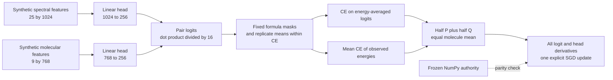

# Energy-balanced projection: a numerical reference

If one molecule has many measurements at one collision energy, an ordinary
spectrum-weighted loss lets that energy dominate training. This component gives
each molecule equal weight, then gives each observed energy equal weight within
that molecule. It makes the resulting gradients easy to inspect and reproduce.

The experiment uses seven synthetic identities in three formula groups of sizes
3, 2 and 2. Its 22 active rows deliberately include unequal replicate counts and
missing energies. Three padded rows and two padded columns test exclusion.
Every candidate in each formula group has observations. The random feature
arrays represent synthetic inputs; they are not chemical encoder outputs.



## Run it

The tested runtime is Python3.12 on POSIX with NumPy2.2.6. Linux and macOS
provide the `resource` module used for the 60-second process CPU cap. The
launcher also imposes a 90-second wall timeout. It starts a separate process
with BLAS/OMP thread counts fixed at one.

```bash
python3.12 -m venv .venv
.venv/bin/python -m pip install -r requirements.txt
.venv/bin/python run_study.py --output ./my-first-run
```

Run these commands from this component directory. The output directory must be
new and its parent must exist. It is retained with the staged sources, frozen
input protocol and terminal receipt. Choosing an existing output path is refused
before a new study starts. The launcher verifies both source hashes first.

The first output line reports the status, 16 checks, elapsed time and receipt
hash. The final line identifies the retained receipt. Timing and receipt hashes
vary between runs; numerical comparison tolerances are frozen in the protocol.

## Configuration and meaning

Both heads are original dense linear maps, without biases or normalization:
`S @ Ws` and `M @ Wm`. Logits are their dot products divided by `sqrt(256)`.
The seed is 20261005, `eta=0.5`, and the explicit SGD learning rate is 0.05.
The study first uses float64, then measures float32 disagreement separately.
The frozen source keeps these settings fixed for a reproducible reference;
an independently named experiment can explore a different setting.

The loss averages replicate logits within each observed energy. Its pooled
term is cross-entropy after averaging those energy means; its second term is
the mean cross-entropy of the individual energy means. The two terms receive
equal weight, followed by an equal mean over molecules. Only complete
same-formula candidates participate in each cross-entropy. Padding contributes
exactly zero derivative. Missing energies are excluded from the average.

The retained [terminal receipt](terminal_receipt.json) compares every one of the
458,752 head derivatives and one SGD update. It also checks 32 sampled parameter
finite differences, row and column permutations, extreme excluded logits,
missing energies and replicate duplication. Full head gradients from both loss
implementations use the same explicit chain rule; the sampled finite differences
provide an independent numerical check of that chain rule.

## Recorded result

On the recorded CPU run, all 16 checks passed in 0.08847400000000001 process CPU
seconds and 0.13440975000048638 wall seconds. The float64 loss matched exactly at
1.240346261752505, with maximum logit-gradient difference
1.3877787807814457e-17. The maximum sampled finite-difference error was
2.033911233878527e-11.

Duplicating one energy's single row nine more times changed the equal-energy
spectral-head gradient by 4.1869070061476865e-16 relative L2. The ordinary
replicate-weighted gradient changed by 1.4561375581373033 relative L2. This is
the intended numerical invariance, rather than evidence about chemical quality.

Float32 produced an end-to-end loss difference of 4.08398251883213e-7 against
the original float64 run. Spectral and molecular head-gradient relative L2
differences were 7.24258970038013e-7 and 8.326843077554202e-7. The receipt also
separates same-logit arithmetic disagreement from end-to-end rounding.

These observations establish the synthetic numerical contract. There is no
encoder run, fitted chemical model, retrieval benchmark, TPU measurement or
competition-score result in this component.

## Sources and license

`projection_parity_study.py` is the byte-exact study source. The numerical
authority, `frozen_energy_authority.py`, is the byte-exact original NumPy
energy-balanced objective developed in this campaign. The launcher adapts the
retained study layout without changing either source. All component code is
original and released under the [MIT license](LICENSE).

[provenance.json](provenance.json) records source and evidence hashes, runtime,
scope and the fresh repository snapshot used when preparing this component.
The included input protocol and terminal receipt are the original observed
files, preserved byte-for-byte. The provenance records their hashes; no model
or external dataset artifact is redistributed.
